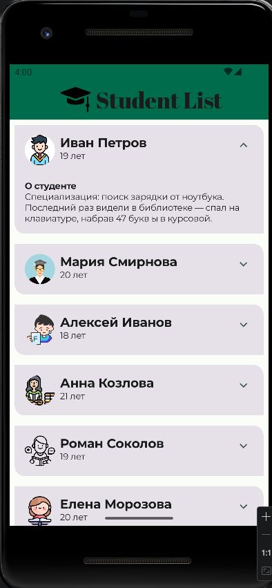

# Student Material Design — Список студентов

## Краткое описание
Приложение для отображения списка студентов с возможностью раскрытия подробной информации. Реализовано с использованием Material Design 3 и Jetpack Compose.

## Цель работы
Научиться применять принципы Material Design в Android-приложениях с использованием Jetpack Compose: цветовые схемы, типографику, формы и анимации.

## Функциональность
- Отображение списка из 10 студентов
- Каждый студент имеет: аватарку, имя, возраст
- Круглые аватарки (обрезка изображений)
- Карточки с диагональным скруглением углов
- Возможность раскрыть/свернуть описание студента
- Плавная анимация при раскрытии
- Верхняя панель приложения (TopAppBar) с логотипом и названием
- Поддержка светлой и тёмной темы
- Кастомные шрифты (Abril Fatface, Montserrat)

## Технологии
- **Kotlin** — язык программирования
- **Jetpack Compose** — декларативный UI
- **Material Design 3** — дизайн-система
- **Material Theme Builder** — создание цветовой схемы
- **Кастомные шрифты** — Abril Fatface, Montserrat
- **Анимации** — spring-анимация раскрытия карточек
- **Git** — система контроля версий

## Скриншоты
 

## Авторы
**Студенты:** [Богданов Иван и Шумила Диана]  
**Группа:** [ИСП-233]  
